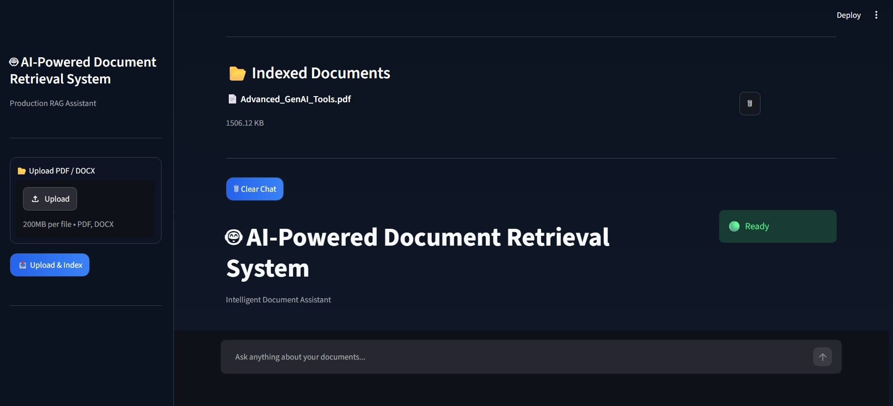
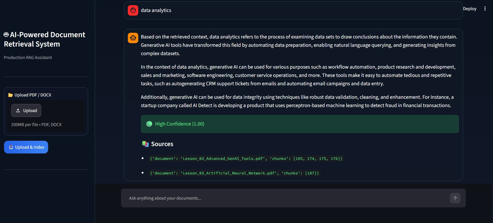
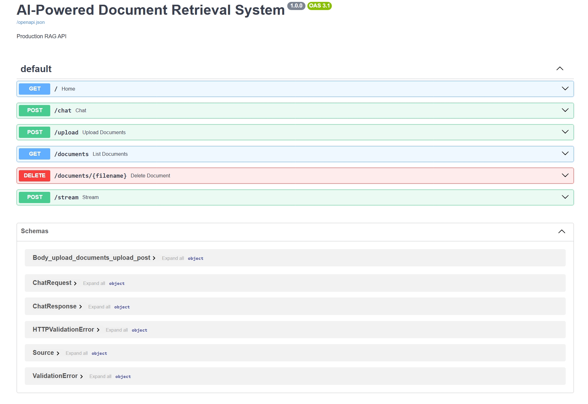

# AI-Powered Document Retrieval System


A production-oriented Retrieval-Augmented Generation (RAG) system for intelligent document retrieval and question answering using Hybrid Search (FAISS + BM25), Cross-Encoder Reranking, FastAPI, Streamlit, and Ollama.

---

# Overview

This project enables users to upload PDF and DOCX documents and ask natural language questions about their content.

Instead of relying only on vector similarity, the system combines semantic search (FAISS) with keyword search (BM25), reranks retrieved results using a Cross-Encoder model, and generates grounded responses using a locally hosted LLM through Ollama.

The project follows a modular architecture that includes document ingestion, hybrid retrieval, reranking, query rewriting, conversation memory, REST APIs, automated testing, logging and a Streamlit interface.

---

# Demo

> **Screenshots**

### Streamlit Home



### Chat Interface



### FastAPI Swagger UI



---

# Features

- Hybrid Retrieval (FAISS + BM25)
- Cross-Encoder Reranking
- Retrieval-Augmented Generation (RAG)
- Semantic Search
- Query Rewriting
- Conversation Memory
- Source Citation
- Confidence Scoring
- FastAPI REST API
- Streamlit Interface
- PDF & DOCX Support
- Automatic Document Indexing
- GitHub Actions CI
- Logging

---

# Why Hybrid Retrieval?

Traditional vector search performs well for semantic similarity but may miss exact keyword matches.

This project combines:

- **FAISS** for semantic retrieval
- **BM25** for lexical keyword retrieval

Both retrieval results are merged using **Reciprocal Rank Fusion (RRF)**, followed by **Cross-Encoder reranking** to improve the relevance of the final context passed to the LLM.

---

# System Architecture


                   User
                     │
                     ▼
          Streamlit Web Interface
                     │
                     ▼
               FastAPI Backend
                     │
        ┌────────────┴────────────┐
        ▼                         ▼
  Query Router            Conversation Memory
        │
        ▼
  Query Rewriter
        │
        ▼
 Hybrid Retriever (FAISS + BM25)
        │
        ▼
 Cross-Encoder Reranker
        │
        ▼
     Context Builder
        │
        ▼
      Ollama (Llama 3.2)
        │
        ▼
 Generated Answer + Sources
```

---

# Retrieval Pipeline

```text
User Query
     │
     ▼
Query Rewriter
     │
     ▼
Multi-Query Generation
     │
     ▼
FAISS Retrieval
     │
     ├──────────────┐
     ▼              ▼
BM25 Retrieval   Semantic Retrieval
        │
        ▼
Reciprocal Rank Fusion
        │
        ▼
Cross-Encoder Reranker
        │
        ▼
Context Builder
        │
        ▼
Ollama (LLM)
        │
        ▼
Answer + Sources + Confidence Score
```

---

# Tech Stack

| Category | Technology |
|-----------|------------|
| Language | Python 3.11 |
| Backend | FastAPI |
| Frontend | Streamlit |
| LLM | Ollama (Llama 3.2) |
| Embedding Model | all-MiniLM-L6-v2 |
| Vector Store | FAISS |
| Keyword Search | BM25 |
| Reranker | Cross-Encoder (ms-marco-MiniLM-L-6-v2) |
| AI Frameworks | Sentence Transformers, LangChain |
| Document Processing | PyMuPDF, python-docx |
| Testing | Pytest |
| CI/CD | GitHub Actions |

---

# Design Decisions

- FAISS enables fast semantic similarity search.
- BM25 complements semantic search with exact keyword matching.
- Reciprocal Rank Fusion combines both retrieval methods without manual score normalization.
- Cross-Encoder reranking improves retrieval precision before generation.
- Query rewriting enhances follow-up questions.
- Modular architecture keeps retrieval, preprocessing, API, and UI independent.

---

# Project Structure

*(Keep your existing project structure here.)*

---

# Installation

## Clone Repository

```bash
git clone https://github.com/<your-username>/ai-powered-document-retrieval-system.git
cd ai-powered-document-retrieval-system
```

## Create Virtual Environment

```bash
python -m venv venv
```

Activate:

Windows

```bash
venv\Scripts\activate
```

Linux/macOS

```bash
source venv/bin/activate
```

## Install Dependencies

```bash
pip install -r requirements.txt
```

## Install Ollama

Download from:

https://ollama.com/download

Pull model

```bash
ollama pull llama3.2
```

Start Ollama

```bash
ollama serve
```

## Build Vector Database

```bash
python preprocessing/chunking.py

python preprocessing/embeddings.py

python preprocessing/vector_store.py
```

## Run FastAPI

```bash
uvicorn api:app --reload
```

## Run Streamlit

```bash
streamlit run frontend/streamlit_app.py
```

---

# API Endpoints

| Method | Endpoint | Description |
|---------|----------|-------------|
| GET | / | Health Check |
| POST | /chat | Ask questions |
| POST | /upload | Upload and index documents |

---

# Evaluation

The retrieval pipeline was evaluated using a custom evaluation dataset.

Evaluation focused on:

- Retrieval Quality
- Answer Relevance
- Confidence Scores
- Source Accuracy

---

# Challenges

Some key engineering challenges during development included:

- Combining semantic and lexical retrieval effectively.
- Improving retrieval precision using reranking.
- Handling conversational follow-up queries.
- Maintaining modularity while integrating multiple retrieval components.
- Optimizing response quality for locally hosted LLM inference.

---

# What I Learned

Through this project, I gained practical experience with:

- Retrieval-Augmented Generation (RAG)
- Hybrid Search
- FAISS Vector Search
- BM25 Retrieval
- Cross-Encoder Reranking
- Query Rewriting
- FastAPI Development
- Streamlit Applications
- Docker Deployment
- Production-oriented project structure

---

# Future Enhancements

- User authentication
- Multi-user document collections
- Cloud vector databases
- Streaming LLM responses
- Additional LLM providers
- Enhanced metadata filtering
- Support for more document formats

---

# Author

**Anukriti Krishna**

If you found this project useful, consider giving it a ⭐ on GitHub.
